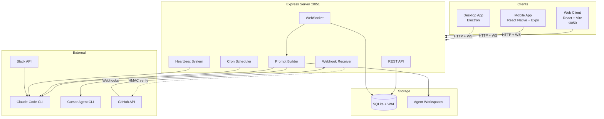
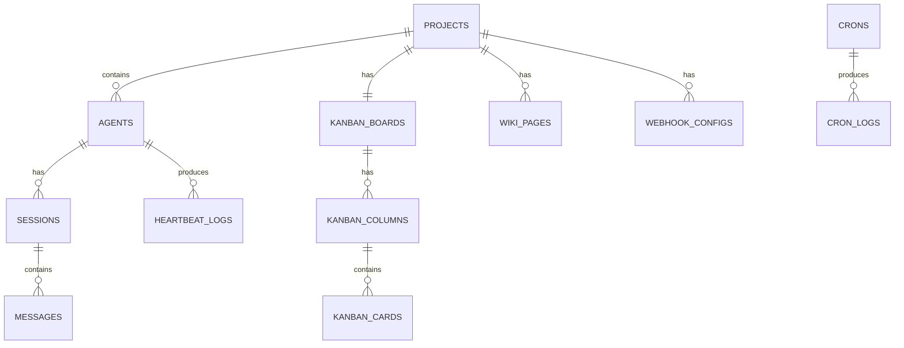

# Agent Hub

A full-stack command center for AI agent orchestration. Manage, monitor, and interact with AI agents (Claude Code, Cursor Agent) through real-time chat, automated tasks, project-scoped knowledge bases, and kanban-style task boards — across web, mobile, and desktop.

## Features

- **Real-time Chat** — Stream responses from AI agents via WebSocket with persistent session history
- **Multi-Engine Support** — Unified interface for Claude Code and Cursor Agent with per-agent model configuration
- **Project Organization** — Group agents, tasks, and knowledge under projects with dedicated workspaces
- **Kanban Boards** — Per-project task tracking with epics, labels, priorities, and autonomous dispatch
- **Wiki Knowledge Base** — Full-text searchable documentation per project, injected into agent context
- **Scheduled Tasks** — Cron jobs and heartbeat check-ins with configurable prompts
- **GitHub Integration** — Webhook-driven PR lifecycle, automated reviews, and CI monitoring
- **Slack Bot** — Multi-agent Slack integration for team communication
- **Cross-Platform** — Web (React), mobile (React Native/Expo), and desktop (Electron) clients

## Architecture



## Tech Stack

| Layer | Technology |
|-------|------------|
| Server | Node.js, Express, ES Modules |
| Database | SQLite ([better-sqlite3](https://github.com/WiseLibs/better-sqlite3)), WAL mode |
| Real-time | [ws](https://github.com/websockets/ws) (WebSocket) |
| Web Client | React 18, Vite, Tailwind CSS |
| Mobile | React Native, Expo |
| Desktop | Electron |
| Scheduling | node-cron |
| Slack | @slack/bolt |
| Testing | Vitest, supertest |
| Deployment | EC2, Nginx, PM2 |

## Prerequisites

- **Node.js** `>=22.14.0 <23.0.0` — pinned in `engines.node` and `.nvmrc`. The
  version is coupled to Electron 35's bundled Node ABI so `better-sqlite3`
  rebuilds work identically in dev and packaged builds. If you use `nvm`,
  `nvm use` in the repo root will pick up the right version automatically.
- **npm** (ships with Node)
- **A build toolchain** for `better-sqlite3`'s native module:
  - Linux: `sudo apt install build-essential python3`
  - macOS: `xcode-select --install`
  - Windows: `npm install -g windows-build-tools` (admin shell)
- **At least one engine CLI** — see [Engine CLIs](#engine-clis) below. The
  server boots without any installed, but chat sessions cannot run until one
  is on `PATH` or pointed at via config.
- **`gh` CLI** (optional) — only needed for webhook registration helpers and
  the autonomous PR-review flow.

### Engine CLIs

Agent Hub orchestrates third-party agent CLIs — it does **not** ship them.
You need at least one of:

| Engine        | Acquire                                                              | Auto-installer                          | Notes                                                       |
| ------------- | -------------------------------------------------------------------- | --------------------------------------- | ----------------------------------------------------------- |
| Claude Code   | [claude.ai/code](https://claude.ai/code) — Anthropic Pro/Max or API  | _none_ — install per Anthropic's docs   | Paid third-party account required.                          |
| Cursor Agent  | [cursor.com/install](https://cursor.com/install)                     | `bash scripts/ensure-cursor-agent.sh`   | Symlinks to `~/.local/bin/agent`, server's default.         |
| Codex         | `@openai/codex` (npm)                                                | `bash scripts/ensure-codex.sh`          | Symlinks `codex` into `~/.local/bin`.                       |
| Gemini CLI    | Google's official installer                                          | _none_                                  | Same plug-in story as the others — point `geminiBin` at it. |

Once a binary exists on disk, the Hub finds it three ways (in priority order):
**env var** (`CLAUDE_BIN` / `CURSOR_BIN` / `GEMINI_BIN` / `CODEX_BIN`) →
**`~/.agent-hub/data/config.json`** (`claudeBin` etc.) → a **smart PATH probe**
across common install locations (`/usr/local/bin`, `~/.local/bin`,
Homebrew, `~/.nvm/.../bin`, etc.) so GUI launches with a minimal `PATH`
still work. The Settings UI also exposes editable fields for every engine
path — no hand-editing JSON required.

#### `scripts/ensure-cursor-agent.sh`

Wraps `curl -fsS https://cursor.com/install | bash` with an idempotent
check. The installer drops a symlink at `~/.local/bin/agent`, which is
the server's default `cursorBin` — no further configuration needed.
Override with `CURSOR_BIN` or `cursorBin` in `config.json` for
system-wide installs (e.g. `/usr/local/bin/agent`).

On EC2 this is handled for you: `ops/terraform/main.tf` `user_data`
runs the installer at bootstrap, and the dev/prod-2/release-prod
workflows call it again on every SSM rollout so the CLI stays present.

#### `scripts/ensure-codex.sh`

Installs `@openai/codex` via npm and symlinks `codex` into
`~/.local/bin`. Same Terraform + workflow auto-install story as above
(plus a `npm install -g @openai/codex` for the system Node) so PM2
hosts always have it.

## Quick Start

```bash
# Clone the repository
git clone https://github.com/speakmanra/agent-hub.git
cd agent-hub

# Pick the right Node version (uses .nvmrc)
nvm use

# Install all dependencies (root, server, client, mobile)
npm run install:all

# Start the full stack (client + server)
npm run dev
```

The web client opens at [http://localhost:3050](http://localhost:3050) and the API server runs on port 3051.

On first launch, visit the web client and complete the **`/api/auth/setup`**
flow — it creates the first Owner account. No required env vars, no
external services. SQLite is local, FTS5 is built into `better-sqlite3`.

## Deployment Modes

Agent Hub is a **server-first product with an optional native desktop
client** — think Plex or Home Assistant. Three legitimate ways to run it,
all supported today:

| Mode                                | What you run                                                            | When it's the right fit                                                |
| ----------------------------------- | ----------------------------------------------------------------------- | ---------------------------------------------------------------------- |
| **Self-hosted + browser**           | `npm run dev` (or PM2) on a Linux box → hit from any device on the LAN  | You already have a home server / VPS and want zero install on clients. |
| **Self-hosted + Electron remote**   | Same server, plus the Electron app pointed at it via `connConfig.mode = 'remote'` | You want a native window / tray on your laptop without port-forward thinking. |
| **All-in-one Electron (`local`)**   | Packaged Electron app — boots its own server in-process                 | Single-machine use; the easiest install once binaries exist.           |

### Mode 1: Self-hosted server + browser

Run the server on any host that other devices can reach (LAN box,
`ssh -L 3051:localhost:3051 host`, or a public box behind a reverse
proxy). Then point a browser at it.

```bash
# On the server
git clone https://github.com/speakmanra/agent-hub.git
cd agent-hub && nvm use && npm run install:all

# Set ALLOWED_ORIGINS to the URL you'll hit from the browser
ALLOWED_ORIGINS=http://linux-box.local:3051 npm run dev:server
```

**CORS matters here.** Browser requests are gated by an explicit
allowlist in `server/cors-config.ts`; without `ALLOWED_ORIGINS` matching
the origin you load the page from, the browser's SOP will block API
responses. Comma-separate multiple origins. Requests with no `Origin`
header (Electron, mobile, curl, server-to-server) bypass CORS entirely.

For port-forward via SSH, `ALLOWED_ORIGINS=http://localhost:3051` is
usually right.

### Mode 2: Self-hosted server + Electron remote client

Run the server as in Mode 1, then on each desktop install the Electron
app and configure it to talk to the remote hub. `electron/main.js`
reads a `connConfig` and branches on its `mode`:

- `local` — fork the bundled server in-process, load `http://localhost:<port>`.
- `remote` — `mainWindow.loadURL(connConfig.remoteUrl)`, inject auth
  headers (`x-api-key`, JWT) on matching hosts via
  `webRequest.onBeforeSendHeaders`. No server spawned client-side.
- `dev` — load the Vite dev client at `localhost:3050` for development.

`remote-orgs.json` under `app.getPath('userData')` lets you register
multiple remote hubs and switch between them; the `setWindowOpenHandler`
allowlist is built from the configured remote plus every entry there, so
external link clicks and PR captures behave correctly.

Electron remote mode does **not** care about `ALLOWED_ORIGINS` because
Electron does not send an `Origin` header.

### Mode 3: All-in-one Electron

The packaged Electron app boots the same Express server in-process under
`ELECTRON_RUN_AS_NODE` (so `better-sqlite3` is rebuilt against
Electron's Node ABI by `electron-builder`). No port-forward thinking,
no server install — single binary.

**Status today:** there's no published installer in the GitHub releases
section yet. To get an Electron app right now you must clone and build
it yourself:

```bash
npm run electron:build      # macOS DMG (arm64 + Intel)
npm run electron:pack       # --dir output for local smoke-test
```

The mac build pipeline (`electron/release-mac.mjs`) uploads versioned
DMGs to S3 on every tagged release, but the bucket is currently
internal-only. A public download URL + Linux/Windows CI jobs are tracked
on the kanban board.

## Configuration

The **primary** config file lives at `~/.agent-hub/data/config.json`. A
legacy `server/config.json` is still honoured as a fallback when the
data-dir copy is missing, but new installs should write to the data
dir:

```json
{
  "port": 3051,
  "claudeBin": "/usr/local/bin/claude",
  "cursorBin": "/usr/local/bin/agent",
  "geminiBin": "/usr/local/bin/gemini",
  "codexBin": "/usr/local/bin/codex",
  "defaultCwd": "/home/youruser",
  "apiKey": null,
  "publicUrl": null
}
```

You can also edit every CLI path from the **Settings → Engines** UI —
no hand-editing JSON required.

Configuration resolves in priority order: **environment variables** >
**`~/.agent-hub/data/config.json`** > **`server/config.json` (legacy)** >
**built-in defaults**.

| Environment Variable    | config.json Key | Default                  | Description                                          |
| ----------------------- | --------------- | ------------------------ | ---------------------------------------------------- |
| `AGENT_HUB_PORT`        | `port`          | `3051`                   | Server port                                          |
| `AGENT_HUB_HOST`        | `host`          | `127.0.0.1`              | Server bind address                                  |
| `AGENT_HUB_DATA_DIR`    | —               | `~/.agent-hub/data`      | SQLite + workspaces root                             |
| `CLAUDE_BIN`            | `claudeBin`     | _smart probe_            | Path to Claude Code CLI                              |
| `CURSOR_BIN`            | `cursorBin`     | `~/.local/bin/agent`     | Path to Cursor Agent CLI                             |
| `GEMINI_BIN`            | `geminiBin`     | _smart probe_            | Path to Gemini CLI                                   |
| `CODEX_BIN`             | `codexBin`      | `~/.local/bin/codex`     | Path to Codex CLI                                    |
| `AGENT_HUB_DEFAULT_CWD` | `defaultCwd`    | `$HOME`                  | Fallback working directory                           |
| `AGENT_HUB_API_KEY`     | `apiKey`        | `null`                   | Break-glass API key (treated as Owner for all orgs)  |
| `AGENT_HUB_PUBLIC_URL`  | `publicUrl`     | `null`                   | Public URL for webhooks, OAuth callbacks, and spawn `AGENT_HUB_URL` fallback |
| `ALLOWED_ORIGINS`       | —               | `http://localhost:3050`  | Comma-separated browser CORS allowlist               |

> **`ALLOWED_ORIGINS` gotcha:** the `ecosystem.config.cjs` default of
> `https://hub.example.com` is a sample value — override it for any
> non-reference deployment. Browsers that hit an unlisted origin get no
> `Access-Control-Allow-Origin` header and the SOP blocks the response.
> Electron desktop, mobile, curl, and server-to-server callers bypass
> CORS because they don't send an `Origin` header.

## Available Scripts

| Command | Description |
|---------|-------------|
| `npm run dev` | Start client and server concurrently |
| `npm run dev:client` | Start React client on port 3050 |
| `npm run dev:server` | Start Express server on port 3051 |
| `npm run build` | Build the client for production |
| `npm run install:all` | Install deps for all packages |
| `npm run mobile` | Start Expo dev server for mobile |
| `npm run electron:dev` | Start Electron desktop app in dev mode |
| `npm test` | Run server tests |
| `npm run test:watch` | Run tests in watch mode |

## Project Structure

```
agent-hub/
├── client/                 # React + Vite web frontend
│   └── src/
│       ├── App.jsx         # Root component with all state management
│       ├── components/     # 18 UI components
│       │   ├── Sidebar.jsx
│       │   ├── KanbanBoard.jsx
│       │   ├── WikiBrowser.jsx
│       │   ├── SettingsPage.jsx
│       │   └── ...
│       ├── hooks/          # useWebSocket.js for real-time connection
│       └── utils/          # API client, time formatting, exports
├── server/                 # Express.js backend
│   ├── index.ts            # All REST + WebSocket routes (Express + WebSocket bootstrap)
│   ├── db.js               # SQLite setup with auto-migrations
│   ├── config.js           # Centralized configuration resolution
│   ├── auth.js             # API key authentication middleware
│   ├── wiki.js             # Wiki CRUD + FTS5 full-text search
│   ├── heartbeat.js        # Cron and heartbeat scheduling
│   ├── slack.js            # Multi-agent Slack bot
│   ├── stream-parser.js    # CLI output stream parsing
│   ├── worktree.js         # Git worktree management
│   └── project-paths.js    # Workspace path resolution
├── mobile/                 # React Native + Expo mobile app
│   ├── App.js              # Entry point with navigation
│   └── src/                # Screens, components, utils
├── electron/               # Electron desktop wrapper
│   ├── main.js             # Main process
│   └── preload.cjs         # Preload script
├── CLAUDE.md               # Developer documentation (for AI agents)
└── package.json            # Root scripts and Electron build config
```

## Core Concepts

### Projects and Agents

**Projects** are the top-level organizational unit. Each project has a working directory (`cwd`), an Agent Hub workspace (`ahw`) for context files, and a color. **Agents** belong to projects and can be configured with different engines (Claude Code / Cursor Agent), models, and custom instructions.

### Enriched Prompts

Before every agent invocation, the server builds an enriched prompt by combining:
1. Agent's base configuration and custom instructions
2. Context files from the workspace (`AGENTS.md`, `SOUL.md`, `MEMORY.md`, etc.)
3. Matching skills from the `skills/` directory
4. Wiki page summaries for the project
5. Daily memory notes

This gives agents persistent project knowledge without manually managing conversation history.

### Real-time Communication

All real-time features use WebSocket:
1. REST endpoint performs a mutation
2. On success, the server broadcasts an event to all connected clients
3. Clients receive the event and refetch relevant data

Events use the format `{ type: 'feature_action', projectId, ...data }`.

### Agent Workspaces

Each agent workspace can contain context files that are automatically injected into prompts:

| File | Purpose |
|------|---------|
| `AGENTS.md` | Agent role definitions and team structure |
| `SOUL.md` | Personality, behavioral guidelines, coding standards |
| `IDENTITY.md` | Identity and background context |
| `USER.md` | User preferences and context |
| `TOOLS.md` | Available tools and usage instructions |
| `MEMORY.md` | Persistent memory across sessions |

## API Overview

The server exposes a RESTful API at `http://localhost:3051/api`. Key resource groups:

| Resource | Endpoints | Description |
|----------|-----------|-------------|
| Projects | `/api/projects` | CRUD for projects and their agents |
| Sessions | `/api/sessions` | Chat session management |
| Messages | `/api/sessions/:id/messages` | Message history |
| Kanban | `/api/projects/:id/board` | Boards, columns, cards, epics, comments |
| Wiki | `/api/projects/:id/wiki` | Knowledge base with full-text search |
| Webhooks | `/api/webhooks` | GitHub webhook configuration |
| Crons | `/api/crons` | Scheduled task management |
| Heartbeats | `/api/agents/:id/heartbeat` | Agent health check scheduling |
| Config | `/api/config` | Server configuration |

Authentication is optional. When `apiKey` is set in config, include `X-API-Key` header or `?apiKey=` query parameter.

## Database

Agent Hub uses **SQLite with WAL mode** for zero-ops persistence. Key tables:



The database file lives at `server/agent-hub.db` (or in `dataDir` if configured). Tables are auto-created on first server start.

## Deployment

### Production (EC2 + Nginx + PM2)

The API is **TypeScript** (`server/index.ts`) and must be started with **tsx** (same as `npm run dev:server`). Do **not** point PM2 at `server/index.js` — that file does not exist.

```bash
ssh ubuntu@your-server
cd ~/agent-hub
git pull
npm install
npm run build
cd server && npm install && cd ..
# First deploy, or after changing the process file:
pm2 start ecosystem.config.cjs
# Routine updates:
pm2 restart agent-hub
```

- **`ecosystem.config.cjs`** runs `node server/node_modules/tsx/dist/cli.mjs index.ts` with `cwd` set to `server/`.
- **Nginx** reverse proxies port 80 to localhost:3051. Keep `proxy_read_timeout` reasonable (e.g. 60s+); GitHub webhooks should get a quick `2xx` from `/api/webhooks/github` (the app responds before long-running work).
- **PM2** manages the Node.js process with auto-restart.
- **Port 3051** is localhost-only; all external traffic routes through Nginx.

**GitHub webhooks:** The **signing secret** configured on the GitHub side must **exactly match** the secret stored in Agent Hub’s webhook config for that repo. Mismatches produce `HMAC verification failed` in logs. The server verifies the raw request body (`express.json` `verify` hook); deploy current server code so HMAC uses the same bytes GitHub signed.

**`gh` CLI on the server:** For autonomous review features, install a recent [GitHub CLI](https://cli.github.com/). Older versions lack `gh pr view --json reviewThreads`; the server falls back to the GraphQL API when that field is missing.

### Monitoring

```bash
pm2 status           # Process status
pm2 logs agent-hub   # Live logs
pm2 monit            # CPU/memory dashboard
```

### Terraform Quickstart (EC2 + ALB + ECR Public)

The `ops/terraform/` module provisions a complete Agent Hub host: VPC, EC2,
dedicated ALB with TLS, IAM, and (by default) the per-PR preview environment
stack. To bring up a new environment from scratch:

```bash
cd ops/terraform
cp terraform.tfvars.example environments/<env>/<env>.tfvars
# edit <env>.tfvars: set name, public_fqdn, base_domain, cert_renewal_email
AWS_PROFILE=<profile> ./scripts/tf-init.sh <env>
AWS_PROFILE=<profile> terraform apply -var-file=environments/<env>/<env>.tfvars
```

### PR Environments — 30-second out-of-box quickstart

PR Environments (per-PR preview deployments) are **on by default** on a fresh
`terraform apply`. The full out-of-box contract — including the prereq flow
diagram, per-prereq remediation, and a troubleshooting matrix — is documented
in [`docs/architecture/pr-environments-out-of-box-contract.md`](docs/architecture/pr-environments-out-of-box-contract.md)
(also published to the project wiki as
**PR Environments — Out of Box Contract**). The short version is three steps:

1. **`terraform apply`** — `enable_pr_environments = true` is the default. A
   fresh apply provisions the wildcard ACM cert, the Route 53 IAM policy on
   the EC2 SSM role, host nginx + certbot + the sudoers allowlist + the
   docker-socket bind-mount, security-group ingress 3100-3999, and the
   Tier-3 `prEnv` block in `<dataDir>/config.json`. First boot also issues
   the wildcard Let's Encrypt cert via `certbot --dns-route53`.
2. **Settings → PR Environments → Register Reviewer App** — the panel runs a
   prerequisite check (Docker, nginx, wildcard cert, GitHub App, Route 53
   IAM, webhook). The GitHub App row stays red until you click **Register
   Reviewer App**, which walks the GitHub App manifest flow and persists
   `appId`, `installationId`, `privateKey`, `webhookSecret`, and
   `clientId`/`clientSecret` automatically — no copy-paste of secrets.
3. **Tick Enable** — the toggle is gated until validation is green. Save,
   open a PR on a webhook-installed repo, and the first preview URL
   (`https://pr-<n>.<pr_env_preview_subdomain>.<alb_fqdn>`) comes up
   automatically.

**Opt out:** set `enable_pr_environments = false` on hosts that will never
run previews. The fine-grained `enable_pr_env_wildcard_cert`,
`enable_pr_env_route53_iam`, and `enable_pr_env_host_nginx` variables remain
as nullable per-piece overrides (default `null` = follow the root flag) —
set them to `true` or `false` only when disabling a single piece for
testing. There is **no separate `AGENT_HUB_PR_ENV_ENABLED` env-var gate**;
the Settings toggle (DB row, with file-block fallback) is the single source
of truth.

## Git Workflow

All feature work uses **worktree-first development**:

1. Branch from `main` with a descriptive name
2. Work entirely on the feature branch
3. Push and open a PR via `gh pr create`
4. Wait for CI checks and code review
5. Human merges to `main` — agents never self-merge

Never commit directly to `main`. Never push to `main` for feature work.

## Contributing

1. Pull latest `main`: `git checkout main && git pull`
2. Create a feature branch: `git checkout -b feature/your-feature`
3. Make your changes following existing code patterns
4. Ensure the build passes: `npm run build`
5. Run tests: `npm test`
6. Push your branch and open a PR: `gh pr create`
7. Wait for CI and review — humans merge to `main`

### Code Conventions

- **ES Modules** throughout (`import`/`export`, no `require`)
- **TypeScript on the server** (`server/`) — strict mode, run with `tsx`; **client and mobile** stay **JavaScript** with JSX
- **PascalCase** for React components, **camelCase** for functions/variables, **kebab-case** for file names
- **Tailwind CSS** utility classes, dark theme by default
- **Raw SQL** with prepared statements via better-sqlite3 (no ORM)
- **Single-file server** — all routes live in `server/index.ts`

## Troubleshooting

| Issue                                              | Solution                                                                                                                                                                                                                       |
| -------------------------------------------------- | ------------------------------------------------------------------------------------------------------------------------------------------------------------------------------------------------------------------------------ |
| `EBADENGINE` / Node version mismatch               | Repo pins `>=22.14.0 <23.0.0`. Run `nvm use` in the repo root; if you switched versions after install, `npm rebuild better-sqlite3`.                                                                                            |
| `better-sqlite3` build fails                       | Ensure build tools are installed: `sudo apt install build-essential python3` (Linux) or `xcode-select --install` (macOS). Then `npm rebuild better-sqlite3`.                                                                    |
| WebSocket connection refused                       | Verify the server is running on port 3051 and no firewall is blocking it.                                                                                                                                                       |
| Browser API calls fail with CORS error             | Set `ALLOWED_ORIGINS=<your-origin>` (comma-separated for multiple). Default is `http://localhost:3050`. Electron / mobile / curl don't need this — only browsers do.                                                            |
| CLI binary not found                               | Update `claudeBin`/`cursorBin`/`geminiBin`/`codexBin` in `~/.agent-hub/data/config.json`, set the matching env var, or use **Settings → Engines** in the UI.                                                                     |
| Electron app can't reach the remote server         | Confirm `connConfig.mode = 'remote'` and `remoteUrl` is correct in `app.getPath('userData')/connConfig.json`. Auth headers (`x-api-key` / JWT) are injected only for hosts matching the configured remote.                       |
| `npm run install:all` fails                        | Try deleting `node_modules` in root, client, server, and mobile, then retry.                                                                                                                                                    |
| Vitest missing devDependency                       | With `NODE_ENV=production`, npm omits devDependencies. Use `npm run install:all` or reinstall per package with `npm ci --include=dev`.                                                                                          |

## License

This project is private and proprietary.
