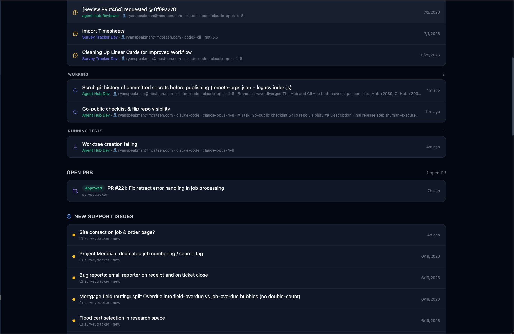
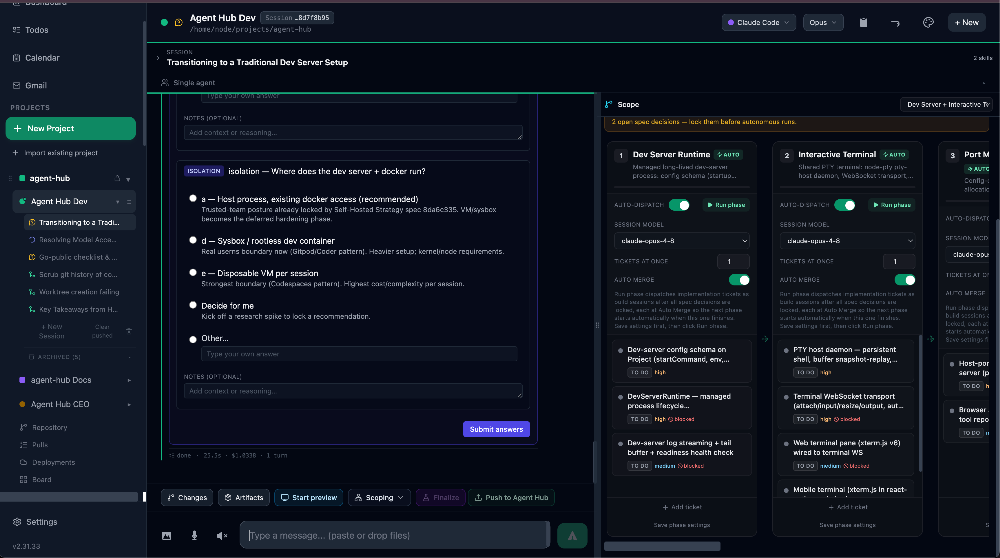
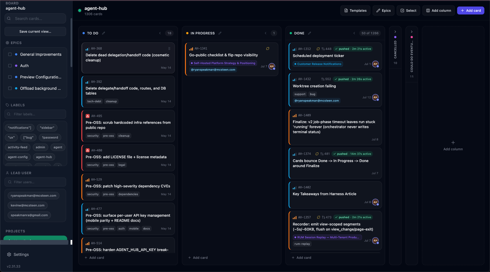
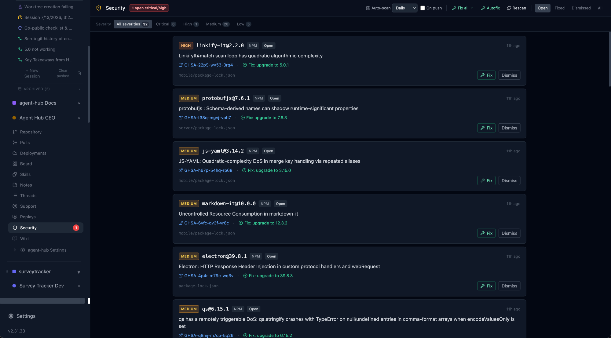
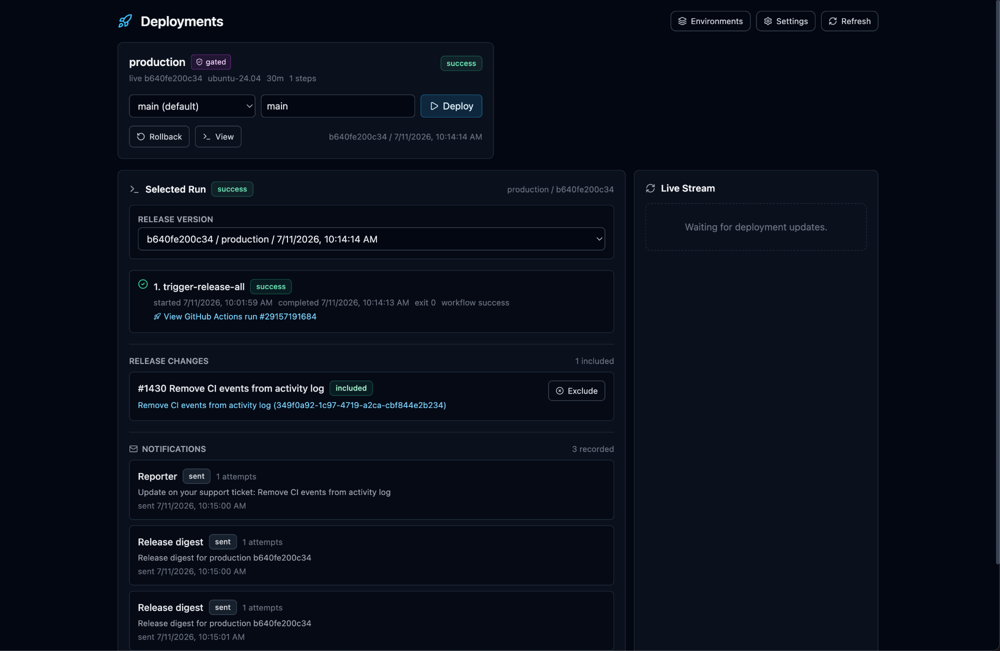
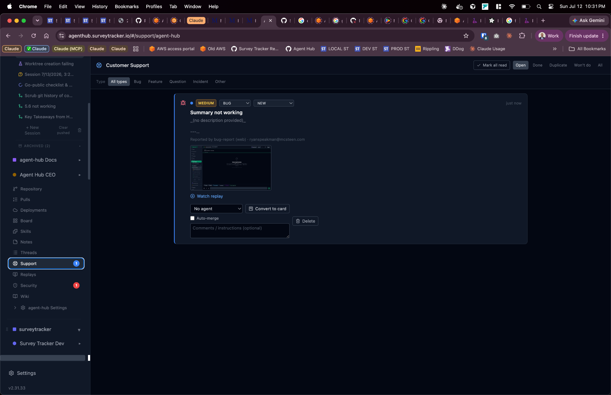
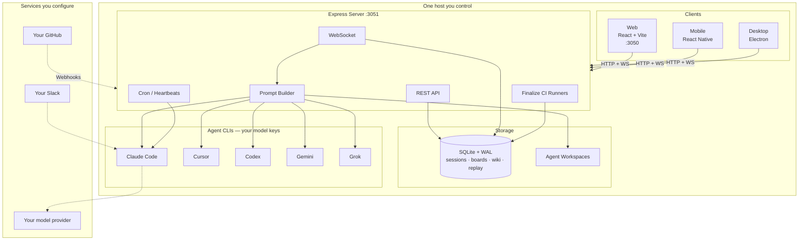
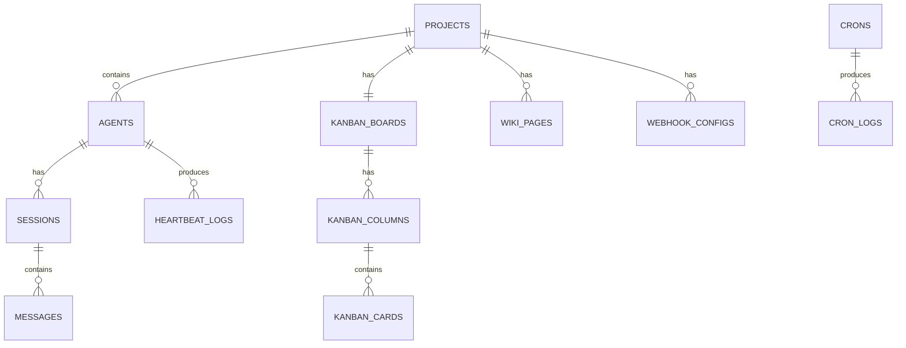

# Agent Hub

**A self-hosted home base for AI coding agents.** Agent Hub runs on your own
machine or server and gives your agents (Claude Code, Cursor, Codex, Gemini,
Grok) a real workspace: chat, a kanban board, a wiki, code review, CI gating,
deployments, and session replay — all in one app, all on hardware you control.

Think of it as the dashboard your agents work *inside*, instead of a chat box
bolted onto your editor.

[](LICENSE)




> **Not an AI coding assistant.** Assistants live in someone else's cloud and
> autocomplete inside your editor — Agent Hub is the **self-hosted DevSecOps platform** the assistant runs *inside*.
> **Your entire SDLC runs in your VPC and never phones home.** You bring your own model keys (BYO-inference), so your code and prompts never leave your network.

---

## What is Agent Hub?

You already have AI coding tools. Agent Hub is the place they live and
collaborate. You create a **project** (usually a git repo), add one or more
**agents** to it, and then talk to them, assign them work, and watch them ship —
from a browser, a phone, or a desktop app.

Everything runs on **one Node process backed by a local SQLite file**. There's
no cloud account, no external database, and nothing phones home. You bring your
own model keys, so your prompts and code go straight from your box to your model
provider and nowhere else.

Two ways to run it (both fully self-hosted):

- **Local** — run it on your own laptop or desktop for yourself. One command,
  open a browser tab, done.
- **Self-hosted server** — run it on a home server, VPS, or cloud VM so you (and
  your team) can reach it from any device on the network.

Same app either way. The only difference is where the server process lives.

---

## What it does

Each project gets its own set of tools. Here's the tour.

### Chat with your agents

Talk to any agent over a live, streaming connection. Pick the engine and model,
attach files, and the agent answers with full context of your project — its
code, wiki, and memory. Agents can also ask *you* structured questions when a
decision needs your input.



### Kanban board

Every project has a board with epics, labels, priorities, and blockers. Assign a
card to an agent and it picks the work up on its own (**autonomous dispatch**),
opens a branch, and reports back. It's issue tracking and task dispatch in one
place.



### Finalize Code Changes (built-in CI gate)

Before any agent's work gets pushed, **Finalize** rebases the branch, runs an
in-hub review, and runs your test suite on an isolated Docker-in-Docker runner
sized to match a GitHub-hosted runner. You see the review notes and each check
pass or fail, then decide whether to push or merge.


### Session replay (RUM)

Agent Hub can record real user sessions of your app with
[rrweb](https://github.com/rrweb-io/rrweb) and flag frustration signals (rage
clicks, dead clicks, error clicks). Watch a replay, link it to a ticket — a
self-hosted alternative to LogRocket or FullStory.


### Security scanning

Per-commit **secret scanning** checks every commit for leaked credentials and
other findings, with a configurable ignore list so you're not drowning in noise.



### Deployments

Define your environments in a `deploy.yaml` and ship from the app — pick a
branch, hit deploy, watch the live stream, and roll back if needed. Release
digests and notifications keep everyone in the loop.



### Customer support queue

Take in support tickets per project, order them by severity, watch the attached
session replay, and convert a ticket into a kanban card with one click.



### And the rest

- **Wiki** — a per-project knowledge base with full-text search that gets
  injected into agent context, so agents actually know your project.
- **Code review & PRs** — webhook-driven GitHub PR lifecycle with automated
  agent reviews.
- **Scheduled work** — cron jobs and per-agent heartbeat check-ins.
- **Slack** — a multi-agent Slack bot for talking to agents from your chat tool.
- **Cross-platform clients** — web, mobile (React Native / Expo), and desktop
  (Electron), all with the same features.

### One platform, not five subscriptions

Because it's all in one app, Agent Hub displaces a stack of separate SaaS
products — one bill, one data boundary, one place to look:

| Instead of…                         | Agent Hub gives you                        |
| ----------------------------------- | ------------------------------------------ |
| Jira / Linear / GitHub Projects     | Kanban boards with autonomous dispatch     |
| CircleCI / GitHub Actions minutes   | Finalize Code Changes CI gating            |
| LogRocket / FullStory / Datadog RUM | Session replay with frustration signals    |
| Vercel / Netlify preview seats      | Per-PR preview environments                |
| Confluence / Notion                 | Per-project wiki with full-text search     |
| Standalone secret scanners          | Per-commit secret scanning                 |

And because the same agents can author the config, an agent stands the platform up for itself —
point it at your repo and it writes the `ci.yaml`, `deploy.yaml`, and dev-server preview config.

---

## Quick start (run it locally)

```bash
# Clone the repo
git clone https://github.com/Speakman-ai/agent-hub.git
cd agent-hub

# Use the pinned Node version (reads .nvmrc)
nvm use

# Install everything (root, server, client, mobile)
npm run install:all

# Start the client + server together
npm run dev
```

Open **[http://localhost:3050](http://localhost:3050)** in your browser. The API
server runs on port 3051. On first launch you'll complete a short
**`/api/auth/setup`** flow to create the first account.

There are **no required environment variables and no external services** —
SQLite is local and search is built in. Add at least one
[engine CLI](#engine-clis) and its model key and you have a working setup.

### Prerequisites

- **Node.js** `>=22.14.0 <23.0.0` — pinned in `.nvmrc` (run `nvm use`). The
  version is tied to Electron's bundled Node so `better-sqlite3` builds the same
  in dev and packaged apps.
- **npm** (ships with Node).
- **A C build toolchain** for `better-sqlite3`'s native module:
  - Linux: `sudo apt install build-essential python3`
  - macOS: `xcode-select --install`
  - Windows: [Visual Studio Build Tools](https://aka.ms/vs/17/release/vs_BuildTools.exe)
    with the "Desktop development with C++" workload, or re-run the
    [Node.js installer](https://nodejs.org/) and tick "Automatically install the
    necessary tools".
- **At least one engine CLI** (below). The server boots without one, but chat
  sessions can't run until a CLI is on `PATH` or pointed at in config.
- **`gh` CLI** (optional) — only for GitHub webhook helpers and autonomous PR
  review.

### Engine CLIs

Agent Hub drives third-party agent CLIs — it doesn't ship them and never proxies
your prompts. You bring the binary and the key; model traffic goes straight from
your box to your provider.

| Engine       | Get it                                                              | Auto-installer                        | Notes                                                       |
| ------------ | ------------------------------------------------------------------- | ------------------------------------- | ----------------------------------------------------------- |
| Claude Code  | [claude.ai/code](https://claude.ai/code) — Anthropic Pro/Max or API | _none_ — install per Anthropic's docs | Paid third-party account required.                          |
| Cursor Agent | [cursor.com/install](https://cursor.com/install)                    | `bash scripts/ensure-cursor-agent.sh` | Symlinks to `~/.local/bin/agent`, the server's default.     |
| Codex        | `@openai/codex` (npm)                                               | `bash scripts/ensure-codex.sh`        | Symlinks `codex` into `~/.local/bin`.                       |
| Gemini CLI   | Google's official installer                                         | _none_                                | Point `geminiBin` at it.                                    |
| Grok Build   | [x.ai/cli](https://x.ai/cli)                                        | `bash scripts/ensure-grok.sh`         | Symlinks to `~/.local/bin/grok`. Auth via `XAI_API_KEY`.    |

Once a binary is on disk, the Hub finds it three ways (in priority order): an
**env var** (`CLAUDE_BIN` / `CURSOR_BIN` / `GEMINI_BIN` / `CODEX_BIN` /
`GROK_BIN`) → **`~/.agent-hub/data/config.json`** (`claudeBin`, etc.) → a **smart
PATH probe** across common install locations. You can also set every path from
**Settings → Engines** in the UI — no JSON editing required.

---

## Run it on a server (self-hosted)

Agent Hub is a **server-first app with an optional desktop client** — a bit like
Plex or Home Assistant. Three supported ways to run it, all self-hosted:

| Mode                              | What you run                                                             | Best for                                                          |
| --------------------------------- | ------------------------------------------------------------------------ | ----------------------------------------------------------------- |
| **Server + browser**              | `npm run dev` (or PM2) on a Linux box, reached from any device on the LAN | You have a home server / VPS and want zero install on clients.    |
| **Server + Electron remote**      | The same server, plus the Electron app pointed at it                     | A native window/tray on your laptop, no port-forward juggling.    |
| **All-in-one Electron (`local`)** | The packaged Electron app — boots its own server in-process              | Single-machine use; easiest once installers exist.               |

### Server + browser

Run the server on any host other devices can reach, then point a browser at it.

```bash
# On the server
git clone https://github.com/Speakman-ai/agent-hub.git
cd agent-hub && nvm use && npm run install:all

# Option A — full dev stack (Vite UI on :3050, API on :3051).
# Set ALLOWED_ORIGINS to the URL the browser loads (the Vite port).
ALLOWED_ORIGINS=http://linux-box.local:3050 npm run dev

# Option B — production-style: build the client once, serve everything
# from the API server on a single port (:3051).
npm run build
ALLOWED_ORIGINS=http://linux-box.local:3051 npm run dev:server
```

**Pick a port and match it.** `npm run dev:server` only serves the client on
`:3051` if `client/dist/index.html` exists (created by `npm run build`);
otherwise `:3051` in a browser 404s. So either run `npm run dev` and use `:3050`,
or `npm run build` first and use `:3051`.

**CORS matters here.** Browser requests are gated by an allowlist in
`server/cors-config.ts`. If `ALLOWED_ORIGINS` doesn't match the origin you load
the page from, the browser blocks the API responses. Comma-separate multiple
origins. Requests with no `Origin` header (Electron, mobile, curl,
server-to-server) skip CORS entirely. For SSH port-forward
(`ssh -L 3050:localhost:3050 host`), use `ALLOWED_ORIGINS=http://localhost:3050`.

### Server + Electron remote client

Run the server as above, then install the Electron app on each desktop and point
it at the hub. `electron/main.ts` reads a `connConfig` and branches on `mode`:

- `local` — fork the bundled server in-process, load `http://localhost:<port>`.
- `remote` — load `connConfig.remoteUrl`, inject auth headers (`x-api-key`, JWT)
  on matching hosts. No server spawned on the client.
- `dev` — load the Vite dev client at `localhost:3050`.

`remote-orgs.json` under `app.getPath('userData')` lets you register and switch
between multiple remote hubs. Electron remote mode ignores `ALLOWED_ORIGINS`
because Electron sends no `Origin` header.

### All-in-one Electron

The packaged Electron app boots the same Express server in-process, so there's no
separate server to run. There's no published installer in GitHub releases yet, so
for now you build it yourself:

```bash
npm run electron:build      # macOS DMG (host arch only)
npm run electron:pack       # --dir output for a local smoke-test
npm run release:mac         # macOS DMG (arm64 + Intel universal)
```

A public download URL plus Linux/Windows CI jobs are tracked on the kanban board.

---

## Configuration

The primary config file is `~/.agent-hub/data/config.json`. A legacy
`server/config.json` still works as a fallback, but new installs should write to
the data dir:

```json
{
  "port": 3051,
  "claudeBin": "/usr/local/bin/claude",
  "cursorBin": "/usr/local/bin/agent",
  "geminiBin": "/usr/local/bin/gemini",
  "codexBin": "/usr/local/bin/codex",
  "defaultCwd": "/home/youruser",
  "apiKey": null,
  "publicUrl": null
}
```

You can edit every CLI path from **Settings → Engines** in the UI. Config
resolves in priority order: **env vars** > **`~/.agent-hub/data/config.json`** >
**`server/config.json` (legacy)** > **built-in defaults**.

| Environment Variable    | config.json Key | Default                                       | Description                                                              |
| ----------------------- | --------------- | --------------------------------------------- | ------------------------------------------------------------------------ |
| `AGENT_HUB_PORT`        | `port`          | `3051`                                        | Server port                                                              |
| `AGENT_HUB_HOST`        | `host`          | `0.0.0.0`                                     | Bind address (all interfaces; set `127.0.0.1` for loopback only)         |
| `AGENT_HUB_DATA_DIR`    | —               | `~/.agent-hub/data`                           | SQLite + workspaces root                                                 |
| `CLAUDE_BIN`            | `claudeBin`     | _smart probe_                                 | Path to Claude Code CLI                                                  |
| `CURSOR_BIN`            | `cursorBin`     | `~/.local/bin/agent`                          | Path to Cursor Agent CLI                                                 |
| `GEMINI_BIN`            | `geminiBin`     | _smart probe_                                 | Path to Gemini CLI                                                       |
| `CODEX_BIN`             | `codexBin`      | `~/.local/bin/codex`                          | Path to Codex CLI                                                        |
| `GROK_BIN`              | `grokBin`       | `~/.local/bin/grok`                           | Path to Grok Build CLI                                                   |
| `AGENT_HUB_DEFAULT_CWD` | `defaultCwd`    | `$HOME`                                       | Fallback working directory                                              |
| `AGENT_HUB_API_KEY`     | `apiKey`        | `null`                                        | Break-glass API key (treated as Owner for all orgs)                     |
| `AGENT_HUB_PUBLIC_URL`  | `publicUrl`     | `null`                                        | Public URL for webhooks, OAuth callbacks, spawn fallback                |
| `ALLOWED_ORIGINS`       | —               | `http://localhost:3050,http://127.0.0.1:3050` | Comma-separated browser CORS allowlist                                  |

> **Bind-address note:** the server binds to `0.0.0.0` by default, so on a LAN
> box the API is reachable on every interface. That's right for the server modes,
> but on a shared host where only the local UI should reach the API, set
> `AGENT_HUB_HOST=127.0.0.1`.

---

## How it fits together

Agent Hub follows a **control-plane / data-plane split**: everything that
touches your code, prompts, and recordings runs inside your VPC (the data
plane). The only piece a vendor could ever host is optional licensing/updates —
never in the path of your data.



Nothing crosses your network boundary unless you wire it there. The dashed edges
are your own integrations — remove them and the app still runs, fully offline.

### Tech stack

| Layer          | Technology                                                                      |
| -------------- | ------------------------------------------------------------------------------- |
| Server         | Node.js, Express, ES Modules, TypeScript (strict)                               |
| Database       | SQLite ([better-sqlite3](https://github.com/WiseLibs/better-sqlite3)), WAL mode |
| Real-time      | [ws](https://github.com/websockets/ws) (WebSocket)                              |
| Web client     | React 18, Vite, Tailwind CSS                                                    |
| Mobile         | React Native, Expo                                                              |
| Desktop        | Electron                                                                         |
| CI runners     | Docker-in-Docker (GitHub-parity resource caps)                                  |
| Session replay | rrweb                                                                            |
| Scheduling     | node-cron                                                                        |
| Slack          | @slack/bolt                                                                      |
| Testing        | Vitest, supertest, Playwright                                                    |
| Deployment     | Self-hosted — Nginx, PM2 (EC2/Terraform reference module included)              |

---

## Core concepts

### Projects and agents

**Projects** are the top-level unit — each has a working directory (`cwd`), an
Agent Hub workspace (`ahw`) for context files, and a color. **Agents** belong to
a project and each has its own engine, model, and custom instructions.

### Enriched prompts

Before every agent run, the server builds a prompt from the agent's config +
workspace context files (`AGENTS.md`, `SOUL.md`, `MEMORY.md`, …) + matching
skills + wiki summaries + daily memory notes. Agents get persistent project
knowledge without you managing conversation history by hand.

| File          | Purpose                                              |
| ------------- | ---------------------------------------------------- |
| `AGENTS.md`   | Agent role definitions and team structure            |
| `SOUL.md`     | Personality, behavioral guidelines, coding standards |
| `IDENTITY.md` | Identity and background context                      |
| `USER.md`     | User preferences and context                         |
| `TOOLS.md`    | Available tools and usage instructions               |
| `MEMORY.md`   | Persistent memory across sessions                    |

### Real-time updates

A REST endpoint performs a mutation, the server broadcasts a WebSocket event
(`{ type: 'feature_action', projectId, ...data }`), and every connected client
refetches. That's how boards, chats, and the wiki stay live across devices.

---

## API overview

The server exposes a REST API at `http://localhost:3051/api`:

| Resource   | Endpoints                    | Description                             |
| ---------- | ---------------------------- | --------------------------------------- |
| Projects   | `/api/projects`              | CRUD for projects and their agents      |
| Sessions   | `/api/sessions`              | Chat session management                 |
| Messages   | `/api/sessions/:id/messages` | Message history                         |
| Kanban     | `/api/projects/:id/board`    | Boards, columns, cards, epics, comments |
| Wiki       | `/api/projects/:id/wiki`     | Knowledge base with full-text search    |
| Webhooks   | `/api/webhooks`              | GitHub webhook configuration            |
| Crons      | `/api/crons`                 | Scheduled task management               |
| Heartbeats | `/api/agents/:id/heartbeat`  | Agent health check scheduling           |
| Config     | `/api/config`                | Server configuration                    |

The full surface is generated from Zod schemas in
[`docs/api/openapi.yaml`](docs/api/openapi.yaml). Auth is optional; when `apiKey`
is set, send the `X-API-Key` header or `?apiKey=` query parameter.

### Database

Agent Hub uses **SQLite with WAL mode** for zero-ops local persistence — the
single file *is* your data. Tables are auto-created on first start.



The file lives at `server/agent-hub.db` (or under `dataDir` if configured). Back
it up, encrypt it, or delete it — it never leaves the host unless you move it.

---

## Available scripts

| Command                | Description                            |
| ---------------------- | -------------------------------------- |
| `npm run dev`          | Start client and server concurrently   |
| `npm run dev:client`   | Start React client on port 3050        |
| `npm run dev:server`   | Start Express server on port 3051      |
| `npm run build`        | Build the client for production        |
| `npm run install:all`  | Install deps for all packages          |
| `npm run mobile`       | Start Expo dev server for mobile       |
| `npm run electron:dev` | Start Electron desktop app in dev mode |
| `npm test`             | Run server tests                       |
| `npm run test:watch`   | Run tests in watch mode                |

## Project structure

```
agent-hub/
├── client/                 # React + Vite web frontend (TypeScript)
│   └── src/
│       ├── App.tsx         # Root component with all state management
│       ├── components/     # UI components (.tsx)
│       ├── hooks/          # useWebSocket.ts for real-time connection
│       └── utils/          # API client, time formatting, exports
├── server/                 # Express.js backend (TypeScript, ESM)
│   ├── index.ts            # Express + WebSocket bootstrap
│   ├── routes/             # REST route modules (Zod + OpenAPI)
│   ├── db.ts               # SQLite setup with auto-migrations
│   ├── config.ts           # Centralized configuration resolution
│   ├── wiki.ts             # Wiki CRUD + FTS5 full-text search
│   ├── heartbeat.ts        # Cron and heartbeat scheduling
│   ├── finalize/           # In-hub CI gating on isolated DinD runners
│   └── worktree.ts         # Git worktree management
├── mobile/                 # React Native + Expo mobile app (TypeScript)
├── shared/                 # Cross-package utilities (strict TypeScript)
├── electron/               # Electron desktop wrapper (TypeScript)
├── e2e/                    # Playwright E2E tests (TypeScript)
├── ops/terraform/          # Self-host reference infra (EC2 + ALB + ECR)
├── CLAUDE.md               # Developer documentation (for AI agents)
└── package.json            # Root scripts and Electron build config
```

---

## Production deployment (Nginx + PM2)

The API is TypeScript (`server/index.ts`) started with **tsx** — do not point PM2
at `server/index.js`, which doesn't exist.

```bash
ssh ubuntu@your-server
cd ~/agent-hub
git pull
npm install
npm run build
cd server && npm install && cd ..
# First deploy, or after changing the process file:
pm2 start ecosystem.config.cjs
# Routine updates:
pm2 restart agent-hub
```

- **`ecosystem.config.cjs`** runs `tsx index.ts` with `cwd` set to `server/`.
- **Nginx** reverse-proxies port 80 to localhost:3051. Keep `proxy_read_timeout`
  reasonable (60s+); GitHub webhooks should get a quick `2xx`.
- **PM2** manages the process with auto-restart.
- **Port 3051** stays localhost-only; external traffic goes through Nginx.

**GitHub webhooks:** the signing secret on GitHub must exactly match the secret
stored in Agent Hub's webhook config for that repo, or you'll see
`HMAC verification failed` in the logs.

### Monitoring

```bash
pm2 status           # Process status
pm2 logs agent-hub   # Live logs
pm2 monit            # CPU/memory dashboard
```

### Terraform (EC2 + ALB + ECR)

The `ops/terraform/` module provisions a full self-hosted host in your account
(VPC, EC2, ALB with TLS, IAM, and by default the per-PR preview stack):

```bash
cd ops/terraform
cp terraform.tfvars.example environments/<env>/<env>.tfvars
# edit <env>.tfvars: name, public_fqdn, base_domain, cert_renewal_email
AWS_PROFILE=<profile> ./scripts/tf-init.sh <env>
AWS_PROFILE=<profile> terraform apply -var-file=environments/<env>/<env>.tfvars
```

Per-PR preview environments are on by default. The full setup contract lives in
[`docs/architecture/pr-environments-out-of-box-contract.md`](docs/architecture/pr-environments-out-of-box-contract.md).

---

## Contributing

Agent Hub is open source under Apache-2.0 — contributions welcome. See
[`CONTRIBUTING.md`](CONTRIBUTING.md) for the full setup and pre-PR checklist, and
the [Code of Conduct](CODE_OF_CONDUCT.md). Found a security issue? Follow the
[Security Policy](SECURITY.md) instead of opening a public issue. The short
version:

1. Pull latest `main`: `git checkout main && git pull`
2. Create a feature branch: `git checkout -b feature/your-feature`
3. Make changes following existing patterns
4. Ensure the build passes: `npm run build`
5. Run tests: `npm test`
6. Push and open a PR: `gh pr create`
7. Wait for CI and review — humans merge to `main`

Never commit directly to `main`, and never merge your own PR.

### Code conventions

- **ES Modules** throughout (`import`/`export`, no `require`)
- **TypeScript everywhere** — strict mode; run `npm run typecheck` before a PR
- **PascalCase** components, **camelCase** functions/variables, **kebab-case** files
- **Tailwind CSS**, dark theme by default
- **Raw SQL** with prepared statements via better-sqlite3 (no ORM)
- **Modular routes** in `server/routes/` with Zod schemas registered for OpenAPI

---

## Troubleshooting

| Issue                                      | Fix                                                                                                                                                                                       |
| ------------------------------------------ | ---------------------------------------------------------------------------------------------------------------------------------------------------------------------------------------- |
| `EBADENGINE` / Node version mismatch       | Repo pins `>=22.14.0 <23.0.0`. Run `nvm use`; if you switched versions after install, `npm rebuild better-sqlite3`.                                                                       |
| `better-sqlite3` build fails               | Install build tools: `sudo apt install build-essential python3` (Linux) or `xcode-select --install` (macOS). Then `npm rebuild better-sqlite3`.                                          |
| WebSocket connection refused               | Verify the server is running on port 3051 and no firewall is blocking it.                                                                                                                 |
| Browser API calls fail with CORS error     | Set `ALLOWED_ORIGINS=<your-origin>` (comma-separated for multiple). Default is `http://localhost:3050,http://127.0.0.1:3050`. Electron / mobile / curl don't need this.                    |
| CLI binary not found                       | Update `claudeBin`/`cursorBin`/`geminiBin`/`codexBin` in `~/.agent-hub/data/config.json`, set the matching env var, or use **Settings → Engines**.                                       |
| Electron app can't reach the remote server | Confirm `connConfig.mode = 'remote'` and `remoteUrl` is correct in `app.getPath('userData')/connConfig.json`. Auth headers are injected only for hosts matching the configured remote.    |
| `npm run install:all` fails                | Delete `node_modules` in root, client, server, and mobile, then retry.                                                                                                                    |
| Vitest missing devDependency               | With `NODE_ENV=production`, npm omits devDependencies. Use `npm run install:all` or `npm ci --include=dev` per package.                                                                    |

---

## License

Agent Hub is licensed under the [Apache License 2.0](LICENSE) — see
[`LICENSE`](LICENSE) and [`NOTICE`](NOTICE) for attribution, and
[`docs/licensing.md`](docs/licensing.md) for the source-header policy and
third-party notes. Agent Hub is **open-core**: the platform in this repo is free
to run, fork, and self-host, with an optional commercial enterprise layer
(SSO/SCIM, RBAC, audit log, per-session isolation) available separately.
