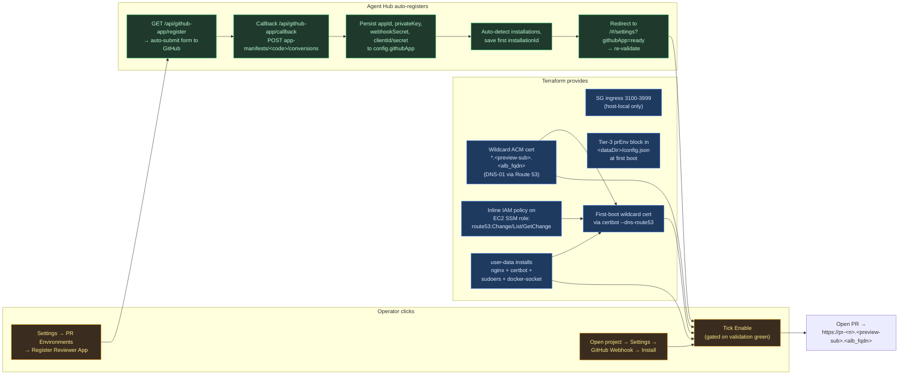

# PR Environments — Out of Box Contract

> **ARCHIVED 2026-05-11.** PR Environments were removed in epic 'Strip PR Environments — In-Session Worktree Previews Only'. Per-PR previews are now the end user's CI concern; Agent Hub ships only in-session worktree previews. See [`preview-model-worktree-previews-only.md`](./preview-model-worktree-previews-only.md).

> **Audience:** A non-author engineer standing up a fresh Agent Hub host and
> turning on per-PR preview environments without reading source code.
>
> **Status (2026-05-04):** Reflects the Pass-2 cleanup — single
> `enable_pr_environments` Terraform flag, Settings prerequisite-check panel
> with one-click Reviewer App registration, and removal of the legacy
> `AGENT_HUB_PR_ENV_ENABLED` env-var override. Builds on PRs #738 / #739 /
> #740 / #741 (Terraform pre-wiring) and PR #763 (env-var gate removed).

## TL;DR

```
terraform apply        →   open Settings → PR Environments
                           click "Register Reviewer App"
                           tick Enable
                           open a PR  →  preview URL
```

That is the entire out-of-box flow on a fresh environment. The rest of this
page documents what each actor in the flow is responsible for, how to
diagnose each prerequisite when it fails, and which historical operator
steps have been **automated away** (and therefore must not be re-introduced
into runbooks or docs).

## Out-of-box flow



Three swimlanes, three colors:

- **Blue — Terraform provides.** Anything on the host (cert, IAM, nginx,
  ports, Tier-3 config) is owned by `ops/terraform/`. A `terraform apply`
  is the **only** operator action required to get all of it. There is no
  shell-in-and-`apt install` step anywhere in the supported flow.
- **Yellow — Operator clicks.** Three clicks, no copy-paste of secrets:
  Register Reviewer App, Tick Enable, Install Webhook (per project).
- **Green — Agent Hub auto-registers.** The GitHub App manifest flow is a
  redirect dance the server walks for you; you never paste an `appId`,
  private-key PEM, webhook secret, or client secret by hand.

## What each actor owns

### Terraform owns

| Resource                                   | Provisioned by                                    | Default knob                       |
| ------------------------------------------ | ------------------------------------------------- | ---------------------------------- |
| Wildcard ACM cert (`*.<preview-sub>.<fqdn>`) | `alb.tf` (`aws_acm_certificate.pr_env_wildcard`) | `enable_pr_environments = true`    |
| Route 53 DNS-01 validation records         | `alb.tf` (`aws_route53_record.pr_env_wildcard_validation`) | follows root flag         |
| EC2 SSM-role inline IAM for Route 53       | `ssm-iam.tf` (`aws_iam_role_policy.pr_env_route53`) | follows root flag                 |
| Host nginx + certbot + sudoers             | `agent-hub-user-data.tftpl` + `main.tf`          | follows root flag                  |
| Docker-socket bind-mount into Hub container | `agent-hub-user-data.tftpl`                      | follows root flag                  |
| SG ingress 3100-3999 (host-local)          | `main.tf` security group block                    | follows root flag                  |
| Tier-3 `prEnv` block in `config.json`      | `agent-hub-user-data.tftpl` first-boot writer + `locals-agent-hub.tf` | follows root flag |
| First-boot wildcard cert issuance          | `agent-hub-user-data.tftpl` (`certbot --dns-route53 ...`) | follows root flag           |

The single root flag `enable_pr_environments` (defaults `true`) drives all
of the above. Three nullable per-piece overrides
(`enable_pr_env_wildcard_cert`, `enable_pr_env_route53_iam`,
`enable_pr_env_host_nginx`) exist for testing one piece in isolation; in
normal operation, leave them at `null`. Effective gating is exposed via the
`pr_env_enabled_effective` Terraform output for CI assertions.

### Operator owns

| Click                                  | Where                                         | Why it's a click and not Terraform |
| -------------------------------------- | --------------------------------------------- | ---------------------------------- |
| Register Reviewer App                  | Settings → PR Environments → "Register Reviewer App" CTA (only renders when the prereq panel shows the GitHub App row red) | Creating a GitHub App requires a logged-in GitHub session. Terraform has no way to assert that identity. |
| Tick Enable                            | Settings → PR Environments → "Feature enabled" toggle | The toggle is intentionally gated on validation passing — flipping it is the operator's go/no-go decision once everything is green. |
| Install GitHub Webhook (per project)   | Open a project → Settings → GitHub Webhook → Install | Webhooks are per-repo. Terraform doesn't know which repos this Hub will service. |

Tier-1 fields (`repoFullName`, `previewHost`, `previewBaseUrl`,
`certRenewalLive`, `portRange`) are also editable in the same panel but are
**pre-populated by the Tier-3 `prEnv` block Terraform writes at first boot**
— in the normal case the operator only confirms them, doesn't enter them.

### Agent Hub auto-registers

When the operator clicks "Register Reviewer App", the server:

1. Serves an auto-submitting HTML form from `GET /api/github-app/register`
   (see `server/routes/config.ts`). The form posts the App manifest to
   `https://github.com/settings/apps/new?state=<csrf>`.
2. After the operator confirms on GitHub, GitHub redirects back to
   `GET /api/github-app/callback?code=<code>`.
3. The server `POST`s `https://api.github.com/app-manifests/<code>/conversions`
   to swap the temporary code for the App's `appId`, `privateKey` (PEM),
   `webhookSecret`, `clientId`, and `clientSecret`. These are persisted to
   `<dataDir>/config.json` under `githubApp`.
4. The server calls `GET /app/installations` (using a fresh JWT minted from
   the just-issued App private key) to discover where the App is installed
   and saves the first `installationId` automatically.
5. The user is redirected to `/#/settings?githubApp=ready`, which triggers
   the Settings panel to re-run validation. The GitHub App row should now
   be green.

Route 53 credentials are **not** entered anywhere. The Hub uses the AWS SDK
default credential chain, which on EC2 resolves through IMDSv2 to the
instance role — to which Terraform has already attached the inline policy.
The `route53` validation row goes green automatically as soon as the
instance role is present.

## Per-prereq remediation

The Settings → PR Environments panel runs six prerequisite checks and shows
each one as a green/red row with a remediation hint. The full matrix:

| Check          | What it asserts                                                                 | When it fails, do this                                                                                             |
| -------------- | ------------------------------------------------------------------------------- | ------------------------------------------------------------------------------------------------------------------ |
| `docker`       | `docker version` succeeds from the Hub process.                                 | `systemctl start docker`. Confirm the Hub container has the host docker socket bind-mounted (Terraform's user-data does this; if you re-templated user-data, diff against `agent-hub-user-data.tftpl`). |
| `nginx`        | nginx is running and the base vhost dirs (`sites-available`, `sites-enabled`) are writable. | `systemctl start nginx`. If the dirs are missing the user-data didn't run cleanly — check `/var/log/cloud-init-output.log` on the EC2 instance and re-apply Terraform if `enable_pr_env_host_nginx` evaluates `false` in the `pr_env_enabled_effective` output. |
| `cert`         | Wildcard TLS cert exists at the path nginx is configured to serve.              | First-boot certbot may still be running on a fresh instance — wait ~1 minute and re-validate. If still red, re-run `sudo certbot certonly --dns-route53 -d "*.<preview-sub>.<alb_fqdn>"` on the host (the sudoers allowlist permits this exact invocation). |
| `github-app`   | The configured GitHub App credentials successfully mint an installation token.  | Click **Register Reviewer App** in the same panel. (If the App was registered but the installation was later removed, install it again on the target org via `https://github.com/apps/<app-slug>/installations/new`.) |
| `route53`      | The current AWS credential chain can `GetHostedZone` on the configured zone.    | Confirm the EC2 SSM role has the `route53:ChangeResourceRecordSets/ListResourceRecordSets/GetChange` inline policy (Terraform attaches this when `enable_pr_env_route53_iam` is effectively true; the `pr_env_enabled_effective.route53_iam` output is the source of truth). On non-EC2 hosts, set explicit `AWS_ACCESS_KEY_ID`/`AWS_SECRET_ACCESS_KEY` env vars on the Hub process. |
| `webhook`      | At least one project has a GitHub webhook installed pointing at this Hub.       | Open a project → Settings → GitHub Webhook → Install. PR-env dispatch fires off webhook deliveries; with zero webhooks installed there's nothing to dispatch on. |

The `Save` button on the panel is disabled while any **required** check is
red (the server returns the `required` set in the validation response so the
list stays in sync as new prereqs are added). The `enabled` toggle is
likewise disabled until the panel sees a green validation result. Both
gates can be force-overridden via "Enable without validation (not
recommended)" — used only when validating against a real GitHub App is
impractical (e.g., air-gapped staging).

## Troubleshooting matrix

| Symptom                                                                                            | Likely cause                                                                                                                                                                | Fix                                                                                                                                                                                                                                                                                  |
| -------------------------------------------------------------------------------------------------- | --------------------------------------------------------------------------------------------------------------------------------------------------------------------------- | ------------------------------------------------------------------------------------------------------------------------------------------------------------------------------------------------------------------------------------------------------------------------------------ |
| `terraform plan` fails with `cert_renewal_email is unset`                                          | `enable_pr_environments = true` (default) but `cert_renewal_email` is empty. Let's Encrypt registration requires it.                                                        | Set `cert_renewal_email = "ops@example.com"` in tfvars. The address is registered with Let's Encrypt for expiration notices.                                                                                                                                                          |
| `terraform plan` fails with `no Route 53 zone is discoverable for base_domain`                     | DNS-01 validation needs a hosted zone. Either `route53_zone_id` is unset, or `lookup_route53_zone_in_this_account = false` and no zone matches.                             | Set `route53_zone_id` directly, or set `lookup_route53_zone_in_this_account = true` so the zone for `base_domain` is resolved in this account. As a last resort, `enable_pr_environments = false` (or per-piece `enable_pr_env_wildcard_cert = false`) skips the cert.                |
| `terraform plan` fails with `enable_instance_ssm = false` on the Route 53 IAM precondition         | The Route 53 inline policy attaches to the SSM EC2 instance role. SSH-only mode has no role to attach to.                                                                   | Set `enable_instance_ssm = true`, or skip the IAM piece with `enable_pr_env_route53_iam = false`.                                                                                                                                                                                     |
| Settings panel shows `nginx` row red after a fresh `terraform apply`                               | First-boot user-data is still running, or it failed.                                                                                                                        | SSH (or SSM Session Manager) into the instance and check `/var/log/cloud-init-output.log`. If `pr_env_enabled_effective.host_nginx` is `false` in `terraform output`, the override is wrong — set the per-piece flag back to `null` so it follows the root.                          |
| Settings panel shows `cert` row red on a healthy-looking instance                                  | First-boot certbot run hadn't finished when the panel was rendered, or the hosted zone changed and the DNS-01 challenge is failing.                                         | Wait 60s and re-validate. If still red, run `sudo certbot certonly --dns-route53 -d "*.<preview-sub>.<alb_fqdn>"` on the host. The sudoers allowlist installed by user-data permits this exact certbot invocation.                                                                    |
| GitHub App row stays red after clicking "Register Reviewer App" and confirming on GitHub           | The callback hit the Hub but `app-manifests/<code>/conversions` failed (network issue, manifest CSRF mismatch, or the App was deleted on GitHub before the callback ran).   | Check the server log for `[GitHub App] Callback failed: …`. Re-click "Register Reviewer App" — the manifest flow is idempotent and the previous half-created App can be deleted from `https://github.com/settings/apps`.                                                              |
| GitHub App row green but Webhook row red                                                           | The App is registered but isn't installed on any repo, or no project has the webhook configured.                                                                            | Visit `https://github.com/apps/<app-slug>/installations/new` to install on the target org/repos, then in Agent Hub open the project → Settings → GitHub Webhook → Install.                                                                                                            |
| PR opens, no preview URL appears                                                                   | Either the webhook never reached the Hub, the `enabled` toggle is off, or the per-PR build failed.                                                                          | Check `Settings → GitHub Webhook → Recent Deliveries` for the PR event. If delivered, check the Hub logs for the dispatch line. Confirm `Settings → PR Environments` shows green prereqs **and** the `enabled` toggle is on. There is no separate env-var gate to also set.           |
| Looking for `AGENT_HUB_PR_ENV_ENABLED`                                                             | This env var was removed in PR #763. The DB row + file-block fallback are the single source of truth.                                                                       | Use the **Settings → PR Environments → Feature enabled** toggle. If you need to script the change, `PUT /api/settings/pr-env` with `{"enabled": true}` (or set `prEnv.enabled` in `<dataDir>/config.json` for first-boot, which Terraform does automatically).                          |

## What is *not* an operator responsibility anymore

These steps appeared in earlier runbooks. They are now provisioned by
Terraform and **must not** be added back to operator-facing docs:

- `apt install nginx certbot python3-certbot-dns-route53` — done by user-data.
- Hand-writing `/etc/nginx/sites-available/agent-hub.conf` — base vhost is
  templated by user-data; per-PR vhosts are dropped into `/etc/nginx/conf.d/agent-hub-pr-*.conf`
  by the runtime, not by the operator.
- Pasting Route 53 IAM access keys into Settings → PR Environments →
  Credentials → Route 53. The Hub uses the EC2 instance role via IMDSv2;
  the inline policy is attached by `ssm-iam.tf`. Pasting keys here is only
  valid for non-EC2 hosts.
- Issuing the wildcard cert manually with `certbot --dns-route53 ...` on
  first boot. user-data does it. Manual `certbot` runs are only a
  remediation step when the first-boot run failed.
- Editing the `prEnv` block in `<dataDir>/config.json` by hand at install
  time. The Tier-3 block is written by the user-data first-boot script
  (see `agent-hub-user-data.tftpl` and `locals-agent-hub.tf`). After the
  first boot, Tier 1 + Tier 2 fields are owned by the SQLite `pr_env_config`
  row and edited through the Settings UI; only Tier 3 (host paths) stays in
  the file.
- Setting `AGENT_HUB_PR_ENV_ENABLED=true` in `ecosystem.config.cjs`,
  systemd, or a docker-compose env block. Removed in PR #763.

## Acceptance check — can a fresh engineer follow this end-to-end?

1. Clone the repo, copy `ops/terraform/terraform.tfvars.example` to a new
   environment file, set `name`, `public_fqdn`, `base_domain`, and
   `cert_renewal_email`. Leave `enable_pr_environments` at its `true`
   default.
2. `terraform init && terraform apply -var-file=…`. Wait for the EC2
   instance to come up healthy.
3. Open the Hub at `https://<public_fqdn>`. Log in with the initial
   credentials (printed at first boot to `<dataDir>/initial-credentials.txt`).
4. Settings → PR Environments. Run Validate. Five rows green; `github-app`
   red. Click **Register Reviewer App** → confirm on GitHub → install on
   the target org → land back on the panel with all six rows green.
5. Tick **Feature enabled** → Save.
6. Open a project in the Hub for the target repo. Settings → GitHub Webhook
   → Install.
7. Open a PR on that repo. Within ~30s, the PR comment from the Reviewer
   App contains a preview URL of the form
   `https://pr-<n>.<pr_env_preview_subdomain>.<alb_fqdn>`.

If steps 1-7 succeed without consulting source files outside `ops/terraform/`
and this page, the contract is honored.

## Related pages

- [PR Environments — UI Configuration & Secret Store](/projects/agent-hub/wiki/pr-environments-ui-configuration-secret-store) — three-tier config split, encryption, REST contract.
- [PR Environments — Per-Project Config, Wizard & Script-Mode Builder](/projects/agent-hub/wiki/pr-environments-per-project-config-wizard-script-mode-builder) — multi-repo wizard layered on top of this baseline.
- [Container Pool — PR Envs + Scaffolding](/projects/agent-hub/wiki/container-pool-pr-envs-scaffolding) — the runtime that actually builds preview containers.
