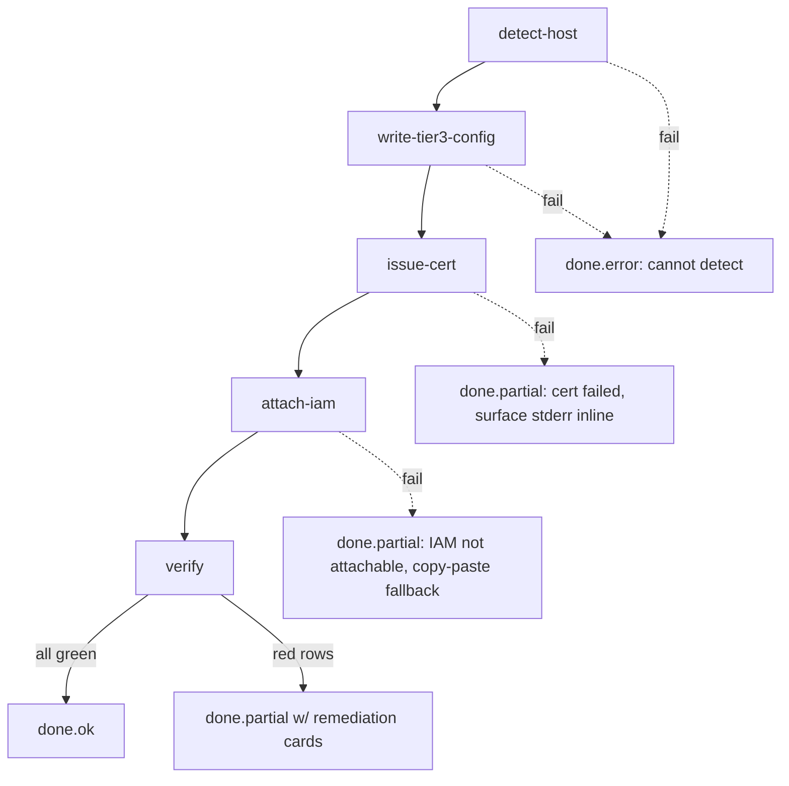

# PR Environments — Provisioning Wizard V1 Spec

> **ARCHIVED 2026-05-11.** PR Environments were removed in epic 'Strip PR Environments — In-Session Worktree Previews Only'. Per-PR previews are now the end user's CI concern; Agent Hub ships only in-session worktree previews. See [`preview-model-worktree-previews-only.md`](./preview-model-worktree-previews-only.md).

> **Audience:** Implementer of the "Provision PR Environments" wizard
> (replacement for the read-only validator panel in `Settings → PR
Environments`). Captures the design contract before code is written so
> reviewers can argue about state-machine boundaries, error surfaces, and
> rollback semantics on the spec rather than in patch comments.
>
> **Status:** Spike (2026-05-05). Not yet implemented. Blocks: PR #787
> (`/proc` walk fallback for the nginx-running check) should land first
> so the verify stage doesn't regress for slim container images while the
> wizard is being built. Companion to [PR Environments — Out of Box
> Contract](pr-environments-out-of-box-contract.md), which documents the
> current Terraform-driven happy path the wizard must subsume.

## Problem statement

The current `Settings → PR Environments` panel is a **read-only validator**:
it surfaces six host-level prerequisites (Docker, nginx + base vhost,
wildcard cert, Reviewer GitHub App, Route 53 IAM, webhook installed) and
asks the operator to chase down each red row by hand —

- SSH/SSM into the EC2 box,
- hand-edit `<dataDir>/config.json` to set `prEnv.nginx.{baseVhostPath,
certPath, keyPath, sitesAvailableDir, sitesEnabledDir, certHome,
previewHost, previewBaseUrl}`,
- run `certbot certonly --dns-route53 -d "*.<previewHost>"`,
- attach an IAM policy via Terraform-by-hand or the AWS console,
- re-click **Validate** after each manual step.

Every one of those steps is something Agent Hub already knows how to do.
The validator surfaces the symptoms; it doesn't fix them. This is the
inverse of the value Agent Hub is supposed to deliver, and the four
bandaid PRs we shipped to make `the sandbox env` green proved it.

> User quote (the test this spec has to pass): _"A user is never going
> to go through all of this to get it set up. The whole point is to
> make this easier. This is making it more difficult."_

## V1 goal

Replace the validator panel with a **Provision PR Environments** wizard
that _does the work_ the validator currently just observes. One button.
Streaming progress. After it runs, the existing checks are green or the
operator gets a remediation card with the _exact next action_ — never a
generic "set this in `config.json`" hint.

The existing `POST /api/settings/pr-env/validate` endpoint is **kept** as
a programmatic hook for crons / dashboards / external healthchecks. The
wizard wraps it but is not a replacement for it.

## Operator UX (the contract this spec defends)

What the operator types into the wizard, _one time_:

| Field            | Why we can't infer it                                      |
| ---------------- | ---------------------------------------------------------- |
| `previewHost`    | Subdomain choice is policy, not infra. e.g. `preview.foo`. |
| Route 53 zone ID | Many AWS accounts have many zones; we won't guess.         |
| GitHub repo      | Same — there's no canonical "the repo".                    |

Everything else is detected, derived, or installed by the wizard. The
operator never edits `config.json`. The "Tier-1 / Tier-2 / Tier-3"
distinction in the current settings page is **invisible** to the operator
in V1; it remains an internal storage detail.

The wizard surface is one button (`Provision`), one streaming progress
panel (phase rows, mirroring the new-project provisioning UI), and one
"last provisioned at <timestamp>" status row. No form fields beyond the
three above.

## State machine

The wizard is implemented as a **phase orchestrator** that mirrors
`server/provisioning/orchestrator.ts`: a fixed ordered phase list, an
injectable executor, and a ring-buffered event stream consumed over
WebSocket so a reconnecting client can replay every event since the run
started.



### Phase contract

Each phase emits the same event shape the new-project orchestrator does:

```ts
{ type: 'phase', phase: <id>, status: 'started' | 'ok' | 'failed' | 'skipped',
  message?: string, at: ISO8601, seq: number }
```

Plus interleaved `{type:'log', line, at, seq}` events for stdout/stderr
from `certbot` and the AWS SDK calls, and a single terminal
`{type:'done', ok|partial|error, remediations?: RemediationCard[], at, seq}`.

### Phase ids (frozen V1 set)

| Id                   | What it does                                                                                   | Skip when                                               |
| -------------------- | ---------------------------------------------------------------------------------------------- | ------------------------------------------------------- |
| `detect-host`        | Probe filesystem + process layout to classify host as `containerized` / `pm2-on-ec2` / `dev`.  | Never.                                                  |
| `write-tier3-config` | Merge derived `prEnv.nginx.*` keys into `<dataDir>/config.json` atomically.                    | `--dry-run` set in body.                                |
| `issue-cert`         | Call `certbot certonly --dns-route53 -d "*.<previewHost>" --hsted-zone-id <zoneId>`.           | Cert at derived `certPath` already exists + >30d valid. |
| `attach-iam`         | Call `iam:PutRolePolicy` on the resolved EC2 instance role.                                    | No AWS keys + no instance role → emit copy-paste card.  |
| `verify`             | Run the existing `validate` adapters (docker / nginx / cert / github-app / route53 / webhook). | Never.                                                  |

The ordering is load-bearing:

1. `write-tier3-config` must precede `issue-cert` so certbot's
   `--cert-name` / `--cert-path` defaults align with what nginx will
   read from the on-disk config.
2. `issue-cert` must precede `verify` because the `cert` check is a
   PEM read from the path we just wrote.
3. `attach-iam` is independent of the cert/nginx phases (it gates
   future runs of `issue-cert`-via-Route-53), so it runs after the cert
   so a half-attached IAM policy can't block first cert issuance.

### Skipped is success

`skipped` is a terminal **ok** status — the wizard finishing with two
phases skipped (e.g. cert already valid, IAM already attached) is a
green run, not a partial one.

## Host detection (`detect-host`)

The wizard supports three host classes. Detection runs probes in this
order and picks the first match; ties resolve toward the _more
constrained_ env (containerized > pm2 > dev) because false-positive on
"dev" would let the wizard try to mutate production paths.

| Class           | Probe                                                                                                | nginx layout                                                                 |
| --------------- | ---------------------------------------------------------------------------------------------------- | ---------------------------------------------------------------------------- |
| `containerized` | `/.dockerenv` exists OR `/proc/1/cgroup` mentions `docker`/`containerd`/`kubepods`.                  | `/etc/nginx/conf.d` (AL2023 / Amazon Linux). No `sites-{available,enabled}`. |
| `pm2-on-ec2`    | `pm2 list` exits 0 AND `/sys/devices/virtual/dmi/id/product_uuid` matches the EC2 UUID prefix `EC2`. | `/etc/nginx/sites-available` + `/etc/nginx/sites-enabled` (Debian/Ubuntu).   |
| `dev`           | Fallback. `process.env.NODE_ENV !== 'production'` AND no nginx process on host.                      | No nginx — wizard writes a `.dev` stub vhost into `<dataDir>/nginx-dev/`.    |

Host class determines `sitesAvailableDir`, `sitesEnabledDir`, and
`baseVhostPath` defaults. Operators can still override via
`<dataDir>/config.json` after first provision; the wizard reads existing
values and keeps them on subsequent runs (the merge in
`write-tier3-config` is _partial-preserving_, never destructive).

## `write-tier3-config` semantics

The current `pr-env-settings.ts` `validate` route hardcodes
`/etc/nginx/sites-available` / `sites-enabled` defaults instead of
reading the saved `sitesAvailableDir` / `sitesEnabledDir`. That is the
underlying root cause of the `the sandbox env` "sites-available: ENOENT"
red row even though `config.json` says `/etc/nginx/conf.d`. The wizard
fixes this in two halves:

1. **`write-tier3-config`** writes the detected paths into
   `<dataDir>/config.json` under `prEnv.nginx`:

   ```jsonc
   {
     "prEnv": {
       "nginx": {
         "previewHost": "preview.example.com",
         "previewBaseUrl": "https://pr-{{number}}.preview.example.com",
         "baseVhostPath": "<derived>",
         "sitesAvailableDir": "<derived>",
         "sitesEnabledDir": "<derived>",
         "certPath": "/etc/letsencrypt/live/preview.example.com/fullchain.pem",
         "keyPath": "/etc/letsencrypt/live/preview.example.com/privkey.pem",
         "certHome": "/etc/letsencrypt",
       },
     },
   }
   ```

2. **DB-row backfill** — same `prEnv.nginx.*` keys are upserted into
   the `pr_env_config` row that the validator reads, closing the
   second underlying bug ("file-block keys aren't merged into the saved
   `pr_env_config` row, so `resolveNginxPaths()` sees empty strings at
   validate time").

The write is **atomic per file**: write to `config.json.tmp`, `fsync`,
`rename`. If the wizard crashes mid-phase, the operator either has the
old config or the new config — never a half-written one.

## Cert issuance (`issue-cert`)

The wizard shells out to `certbot` as a subprocess (NOT in-process via
acme-client) so failures look identical to what an operator would have
seen running it manually — same stderr, same exit code, same hint text.
This deliberately keeps the runbook portable between "operator did it
themselves" and "Hub did it for them."

```bash
certbot certonly \
  --dns-route53 \
  --dns-route53-propagation-seconds 30 \
  -d "*.${previewHost}" \
  -d "${previewHost}" \
  --non-interactive \
  --agree-tos \
  --email "${operatorEmail}"   # falls back to admin@<previewHost> if unset
```

Skip-when-already-valid: if `certPath` exists and parses as an
X.509 with `validTo` >30 days out, emit `status: 'skipped'` with
message `cert valid for <N> more days; nothing to do`. This is the
common case on a re-run.

Failure surfaces inline as a remediation card with three buttons:
**Retry**, **Show last 50 lines of stderr**, **Open Route 53 console for
zone <zoneId>**. The third covers the most common cause: missing
`route53:GetHostedZone` / `ListHostedZones` on the EC2 instance role —
which `attach-iam` later auto-fixes (so the typical recovery is
"continue past cert error → run again").

## IAM policy attach (`attach-iam`)

Two paths, picked by credential availability:

### A. Auto-attach (AWS keys present)

When the operator has explicit `route53AccessKeyId` /
`route53SecretAccessKey` on the saved row, the wizard:

1. Resolves the EC2 instance role via `iam:GetInstanceProfile` on the
   `IamInstanceProfile.Arn` from IMDSv2.
2. Calls `iam:PutRolePolicy` with the inline policy below, named
   `agent-hub-pr-env`. Inline (not managed) so the wizard can re-run
   safely without leaking detached managed-policy ARNs.

```json
{
  "Version": "2012-10-17",
  "Statement": [
    {
      "Sid": "Route53PreviewDns",
      "Effect": "Allow",
      "Action": [
        "route53:GetHostedZone",
        "route53:ListHostedZones",
        "route53:ChangeResourceRecordSets",
        "route53:GetChange"
      ],
      "Resource": "*"
    }
  ]
}
```

### B. Copy-paste fallback (instance role + no keys)

When no static keys are configured (typical Terraform-managed
deployment), the wizard cannot mutate IAM from inside the box without
escalating its own privileges, which is the right answer. Instead it
emits a remediation card with:

- The exact policy JSON above.
- The detected role ARN (e.g. `arn:aws:iam::123:role/agent-hub-ec2-ssm`).
- A one-click **Copy CLI command** that pastes:

  ```bash
  aws iam put-role-policy \
    --role-name agent-hub-ec2-ssm \
    --policy-name agent-hub-pr-env \
    --policy-document file:///tmp/agent-hub-pr-env.json
  ```

- A one-click **Copy Terraform block** that pastes the equivalent
  `aws_iam_role_policy` resource — fixes the third underlying bug
  (Terraform `agent-hub-ec2-ssm` role is missing `route53:GetHostedZone` /
  `route53:ListHostedZones`; should have shipped with PR #785's IAM
  block) when the operator has the option to commit it back.

The phase status is `ok` (the wizard _did_ the right thing — surfaced
the exact next action), not `failed`. Verify will then catch up on the
next run.

## `verify` stage

Re-runs the existing six adapters from `pr-env-settings.ts` (`docker`,
`nginx`, `cert`, `github-app`, `route53`, `webhook`). The wizard's job
is to _make verify green_, not to replicate it. Two notable
contract details:

- The `nginx` adapter must read `sitesAvailableDir` /
  `sitesEnabledDir` from the saved row (not the hardcoded defaults).
  Fixing this is part of `write-tier3-config` landing — the route's
  `pickStr` lookup needs to honour the new keys.
- The `nginx`-running probe falls through `systemctl → pgrep → /proc
walk` (PR #787). The wizard depends on the `/proc` fallback so the
  containerized class doesn't show a false-red `nginx not running` row.

Verify failures don't roll the wizard back; they downgrade `done.ok`
to `done.partial` and attach one **RemediationCard** per failing
required check.

## Remediation card schema

```ts
interface RemediationCard {
  check: 'cert' | 'nginx' | 'github-app' | 'route53' | 'webhook' | 'docker';
  severity: 'red' | 'amber'; // amber = wizard surfaced a copy-paste action
  headline: string; // ≤80 chars, plain English ("Cert issuance timed out.")
  detail?: string; // multi-line context — surfaced expandable
  actions: Array<{
    label: string; // button label
    kind: 'retry' | 'copy' | 'link' | 'open-settings';
    payload?: string; // CLI command, URL, or settings sub-route
  }>;
}
```

Cards are rendered next to the phase row that produced them. The "Fix
the next issue" cursor walks the cards top-down so the operator can
keep clicking **Retry** until everything is green.

## Rollback semantics

V1 is **forward-only**. There is no `Unprovision` button.

Reasoning:

- `write-tier3-config` is partial-preserving — a re-run with corrected
  inputs idempotently updates the same keys.
- `issue-cert` writes to `/etc/letsencrypt/live/<host>/`, which is
  certbot's own directory; rolling that back means
  `certbot delete --cert-name <host>`, which is a destructive action
  the operator should run consciously.
- `attach-iam` writes a _named_ inline policy
  (`agent-hub-pr-env`), so the operator can detach it with a single
  AWS CLI / console action when they're sure they want PR-envs off.

The wizard surfaces a help link in the empty-state ("Already
provisioned? Re-run safely — every phase is idempotent. To remove
PR-envs, see the [Out of Box Contract → Removal](pr-environments-out-of-box-contract.md#removal)
section.").

## API surface

All routes are mounted under `/api/settings/pr-env/`:

| Method | Path                                   | Purpose                                                                                                                                         |
| ------ | -------------------------------------- | ----------------------------------------------------------------------------------------------------------------------------------------------- |
| `POST` | `/provision`                           | Start a provision job. Body: `{ previewHost, hostedZoneId, repoFullName, dryRun? }`. Returns `{ jobId, wsUrl }`.                                |
| `GET`  | `/provision/:jobId/events?since=<seq>` | WebSocket. Replays ring-buffered events ≥ `since`, then live-tails.                                                                             |
| `GET`  | `/provision/last`                      | Returns `{ jobId, finishedAt, ok, partial, lastError? }` for the most-recent run. Used by the Settings panel to render "Last provisioned at …". |
| `POST` | `/validate`                            | **Unchanged.** Programmatic verify hook for crons / external healthchecks.                                                                      |

The `wsUrl` is an absolute `ws://host/api/settings/pr-env/provision/:jobId/events`
URL, mirroring the new-project provisioning convention so the same
`provisioningClient.js` helper can be reused on the front-end.

## Front-end shape

`client/src/components/PrEnvironmentsSection.jsx` becomes:

```
┌───────────────────────────────────────────────────────────┐
│  PR Environments                                          │
│  ─────────────────────────────────────────────            │
│  [previewHost: ___________]                               │
│  [Route 53 zone ID: __________]                           │
│  [GitHub repo (owner/name): __________]                   │
│                                                           │
│  Last provisioned: 2026-05-05 14:22 UTC ✓ all green       │
│                                                           │
│  [ Provision PR Environments ]    [ Re-validate ]         │
│                                                           │
│  ── Progress ─────────────────────────────────────        │
│  ✓ detect-host       containerized (AL2023, conf.d)       │
│  ✓ write-tier3       merged 8 keys into config.json       │
│  ✓ issue-cert        skipped (cert valid for 78 days)     │
│  ⚠ attach-iam        copy-paste required → see card       │
│  ✓ verify            5/6 green                            │
│                                                           │
│  ── Remediation ─────────────────────────────             │
│  ┌ ⚠ Attach IAM policy to agent-hub-ec2-ssm ─────────┐         │
│  │ Wizard couldn't put-role-policy from this box.│         │
│  │ Copy and run from a workstation with admin:   │         │
│  │ [ Copy CLI ]  [ Copy Terraform ]              │         │
│  └───────────────────────────────────────────────┘         │
└───────────────────────────────────────────────────────────┘
```

The validator panel's six-red-row UI and the per-check `CHECK_REMEDIATION`
hint dictionary are deleted. Their replacement is the streaming progress

- remediation cards above. The `Validate` button stays as `Re-validate`
  for paranoid operators who want to re-run the verify adapters without
  re-running provisioning.

## Migration from the validator panel

| Old (validator panel)                                          | New (wizard)                                                          |
| -------------------------------------------------------------- | --------------------------------------------------------------------- |
| Six red rows the operator interprets one by one                | Ordered phase rows the wizard executes; remediation cards on red.     |
| "Set `prEnv.nginx.X` in `<dataDir>/config.json` (Tier 3)" hint | `write-tier3-config` writes those keys; operator never sees the path. |
| "Run `certbot certonly --dns-route53 …`" hint                  | `issue-cert` runs it; surfaces stderr inline on failure.              |
| "Attach the route53 policy to the EC2 role" hint               | `attach-iam` does it (with keys) or surfaces copy-paste (without).    |
| Tier-1 / Tier-2 / Tier-3 vocabulary in the UI                  | Internal storage detail — no longer surfaced to the operator.         |
| Save button gated on `validateResult.ok`                       | Wizard runs to completion; verify drives a "last provisioned" row.    |

The `pr_env_config` table schema does not change. The Tier-3 keys
already exist as nullable columns; the wizard just makes sure they're
populated.

## Lessons borrowed from Vercel

Cross-checked against current Vercel docs (2026-02-27 / 2026-03-17). The
patterns we are intentionally porting:

- **Operator never edits config files.** Vercel asks for repo +
  framework + env vars and derives every host/cert/DNS detail. The
  wizard mirrors this — three inputs, no `config.json` editing.
- **Predictable URL pattern.** `pr-<number>.preview.<previewHost>`
  remains the only V1 pattern. A V1.1 follow-up may add
  `<branch-slug>.preview.<previewHost>` for non-PR branches.
- **Standard system env vars in preview containers.** The wizard does
  _not_ change container env injection — already covered by the
  existing dispatch path. This page documents the existing/future set
  for reference: `AGENT_HUB_ENV={preview|production}`,
  `AGENT_HUB_PREVIEW_URL`, `AGENT_HUB_GIT_SHA`, `AGENT_HUB_GIT_BRANCH`,
  `AGENT_HUB_PR_NUMBER`, `AGENT_HUB_DEPLOYMENT_ID`.
- **Auto-cancel queued builds.** Out of scope for the wizard itself
  (the wizard is one-time platform setup, not per-PR). Tracked as a
  separate dispatcher ticket.
- **Fork PR gating.** Default-on, gated by Owner/Admin role. Out of
  scope for the wizard surface; lives on the existing PR-env Settings
  block as a single toggle.
- **Lifecycle is implicit, not button-driven.** The wizard's
  **Provision** button is for one-time platform setup, _not_ per-PR
  provisioning. Per-PR is automatic via the GitHub webhook and stays
  that way.

## Out of scope (V1)

- Multi-region / multi-cloud (still AWS + Route 53).
- Auto-attach IAM when no AWS keys _and_ no instance role (wizard
  surfaces copy-paste; operator action stays).
- Renewal monitoring (the existing cert-renewal heartbeat keeps
  doing that — the wizard is one-shot).
- `Unprovision` / rollback button — V1 is forward-only.
- Custom Environments (named env-var sets + persistent domain) — defer
  to `mode: workflow` projects.
- Skew Protection, OIDC federation, Bypass tokens — V1.5+.
- Build-on-Hub-infra parity with Vercel — we run on the operator's
  box; that's the self-host promise.

## Acceptance criteria (mirrors the kanban card)

- [ ] Fresh AL2023 EC2 with PR-env enabled in user-data goes from
      0 → fully working PR-envs by clicking one button. Operator only
      enters `previewHost` / repo / Route 53 zone ID.
- [ ] No `config.json` editing required from the operator.
- [ ] IAM policy auto-attached when keys are present, else surfaced as
      a one-click copy with the exact policy doc + target role ARN.
- [ ] `POST /api/settings/pr-env/validate` still works for programmatic
      health checks (cron, dashboards) — same response shape.
- [ ] This wiki page (you're reading it) covers the wizard, failure
      modes, and migration from the old validator panel.

## Open questions for the implementer

1. **Email for `--agree-tos`.** Defaults to `admin@<previewHost>`.
   Should the wizard pull this from the Owner user's email instead?
   (Matters for Let's Encrypt renewal warnings — they go to whatever
   address is on the cert.)
2. **Non-AL2023 / non-Debian distros.** `detect-host` falls through to
   `dev` for anything else, which the wizard refuses to write nginx
   files into. Do we want a `manual-paths` host class that takes
   operator-supplied dir paths, or punt entirely?
3. **`certbot` not on PATH.** Fail the `issue-cert` phase with a
   remediation card that points at the user-data install script? Or
   try to install it (`yum install -y certbot python3-certbot-route53`
   on AL2023, equivalent on Debian)?
4. **DB-row vs config.json source of truth.** Today the validator
   sometimes reads from `pr_env_config` and sometimes from
   `<dataDir>/config.json`. The wizard writes both for safety, but the
   long-term direction (one or the other) should be picked before V1
   ships so we're not still writing twice in V1.5.
